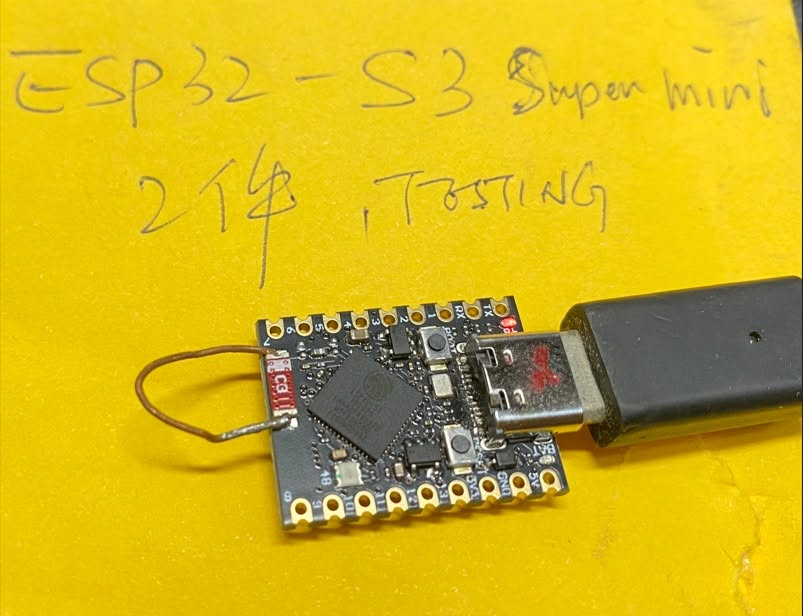
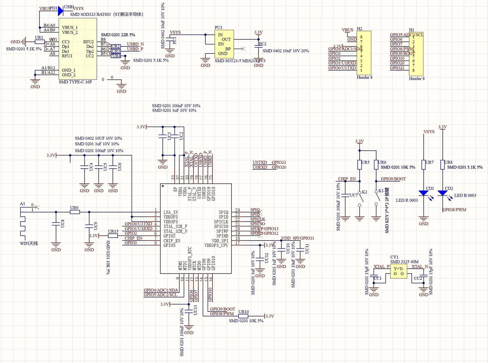
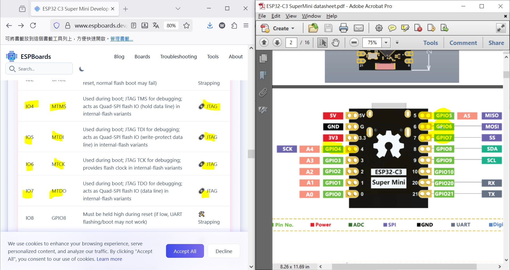
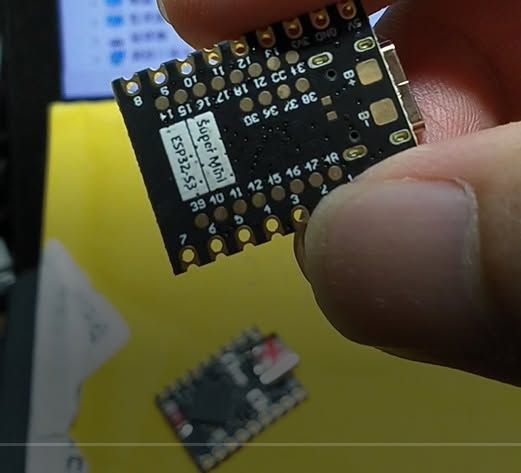
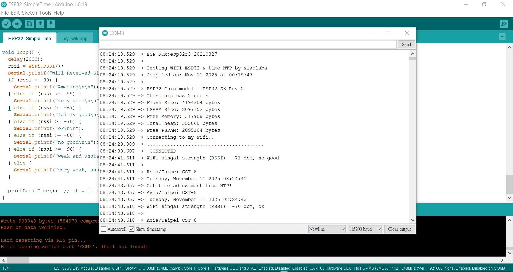
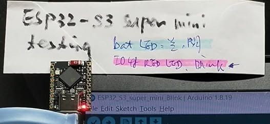

# Arduino_ESP32C3_super_mini_board_WIFI_weak and solution
ESP32C3 or ESP32S3 super mini board, WiFi 弱雞, 簡易的改善方法  
ESP32-super-mini-wifi_antenna_modification.jpg  
  

### ESP32C3 super mini board schematic  
  


### ESP32-C3_JTAG_pin.JPG  
  

### WiFi 弱雞成因  
#ESP32-C3 super mini  
#ESP32-H2 super mini (BLE only, no WIFI)  
#ESP32-S3 super mini  
與其說是盜版, 倒不如說是抄版. 單純用 MCU 的功能不考慮 WIFI / BLE 的話是可以選的, 畢竟就10元不到的人民幣價格, 那隻紅色的陶瓷天線 C3 也是"絕配", 抄襲得不倫不類. 非常多玩家發現了 BLE/WIFI 訊號十分差, 原因也清楚, 大部分的無線電能量發射不出去, 反射回到小板板把自己熱到不要不要.  
如果買了也需要用到 WIFI, 不妨用最簡單的方法,  又來體驗一次 0元 的改善玩法. 自己加一根銅線彎成 U 型, 並接在 紅色的陶瓷天線 C3 的兩頭, 只要長度適合大約圍成 12mm x 6mm 的面積, WIFI RSSI (收訊強度) 可以從原來的 -80dBm (非常弱雞) 大幅改善到達 -65 dBm (很可以). U型的大小長度變化在1~2mm 的範圍, 需要配合不同廠牌的盜版, 效果需要自己拿捏, 無需嚴謹, 試試看就知道.  
掃描熱點的能力也可以從寥寥無幾增加到數十個 (-90dBm). 如果放在 WIFI ROUTER 旁邊更可以達到 -15dBm.  
當然網路上還有很多其他的天線改裝式樣的素材, 大致是這樣, 這個也不是 LOOP 天線, U 型純粹好固定而以, 有能力焊接就固定它, 都是工錢. 抄版的沒事搞個 C3 陶瓷天線也是妙, 不抄沒人買.  
這些數字不需要用到專業儀器的支撐, 含意或許很難理解, 原理分析等等留待教授們研究解答. 普通玩家單純看表現即可, 有需要的參考看看. 不要迷信砸錢搞啥啥天線, 玩得開心有加分就可以, 5米10米的距離估計夠玩樂. 真的要專業花大價錢, 不小心就可能為了品味一滴醬油跑去多買幾隻放山雞, 貴死了.  
測試的源碼不複雜, 抄抄改改就對了. AI 也可以幫忙, 因為有人做過的它就可以抄來用.  


### source code for testing  
[ESP32C3S3_RSSI_boost_testing.ino](ESP32C3S3_RSSI_boost_testing.ino)  
```
/// ESP32-C3/S3_super-mini
/// 4M flash, 2M PSRAM(S3 only)
/// USB CDC on boot : enabled
/// flash mode : DIO
/// testing done, ok, by xiao_laba, 2022
#include <WiFi.h>
#include "time.h"
#include "esp_sntp.h"
//const char *ssid = "YOUR_SSID";
//const char *password = "YOUR_PASS";
//const char *ssid = "my wifi";
//const char *password = "12345678";
//#include "my_wifi.hpp"
const char *ntpServer1 = "pool.ntp.org";
const char *ntpServer2 = "time.nist.gov";
const long gmtOffset_sec = 3600;
const int daylightOffset_sec = 3600;
// see https://github.com/....../posix_tz_db/blob/master/zones.csv
// see https://github.com/....../blob/master/cores/esp8266/TZ.h
// Asia/Taipei  CST-8
// Asia/Tokyo  JST-9
// Asia/Bangkok  <+07>-7
// Europe/Amsterdam  CET-1CEST,M3.5.0,M10.5.0/3
//const char *time_zone = "CET-1CEST,M3.5.0,M10.5.0/3";  // TimeZone rule for Europe/Rome including daylight adjustment rules (optional)
//const char location = "Europe/Amsterdam CET-1CEST,M3.5.0,M10.5.0/3";  // location
const char *time_zone = "CST-8";  // TimeZone rule for Europe/Rome including daylight adjustment rules (optional)
const char *location = "Asia/Taipei CST-8";  // location
void printLocalTime() {
  struct tm timeinfo;
  if (!getLocalTime(&timeinfo)) {
    Serial.println("No time available (yet)");
    return;
  }
  Serial.println(location);
  Serial.println(&timeinfo, "%A, %B %d %Y %H:%M:%S");
}
// Callback function (gets called when time adjusts via NTP)
void timeavailable(struct timeval *t) {
  Serial.println("Got time adjustment from NTP!");
  printLocalTime();
}
void setup() {
  //// CPU : ESP32-D0WD-V3 (revision v3.1), QFN5x5
  //// WeMos D1_R32 or clone, 4MB SPI external flash storage
  //// ESP32-C3 (super-mini,) clone
  //// CPU : ESP32-C3 (QFN32) (revision v0.4)
  //// Features: Wi-Fi, BT 5 (LE), Single Core, 160MHz, Embedded Flash 4MB (XMC)
  //// USB CDC is used, no USB-UART chip is used.
  //// ESP32-S3 (super-mini), clone
  //// CPU : ESP32-S3
  //// 4MB FLASH, 2MB PSRAM
  //// USB CDC is used, no USB-UART chip is used.
  delay(6000);
  //Serial.begin(500000); // no match boot log speed
  Serial.begin(115200); // match boot log speed, 
  Serial.print("\nTesting WIFI ESP32 & time NTP by xiaolaba\n");
  Serial.print("Compiled on: ");
  Serial.print(__DATE__);
  Serial.print(" at ");
  Serial.println(__TIME__);
  Serial.printf("\nESP32 Chip model = %s Rev %d\n", ESP.getChipModel(), ESP.getChipRevision());
  Serial.printf("This chip has %d cores\n", ESP.getChipCores());
  uint32_t flashSize = ESP.getFlashChipSize();
  Serial.printf("Flash Size: %u bytes\n", flashSize);
  uint32_t psramSize = ESP.getPsramSize();
  Serial.printf("PSRAM Size: %u bytes\n", psramSize);
  uint32_t freeMemory = ESP.getFreeHeap();
  Serial.printf("Free Memory: %u bytes\n", freeMemory);
  uint32_t Totalheap = ESP.getHeapSize();
  Serial.printf("Total heap: %u bytes\n", Totalheap);
  uint32_t FreePSRAM = ESP.getFreePsram();
  Serial.printf("Free PSRAM: %u bytes\n", FreePSRAM);
  // First step is to configure WiFi STA and connect in order to get the current time and date.
  //Serial.printf("Connecting to %s\n", ssid);
  Serial.printf("Connecting to my wifi..\n");
  WiFi.begin(ssid, password);
  /**
   * NTP server address could be acquired via DHCP,
   *
   * NOTE: This call should be made BEFORE esp32 acquires IP address via DHCP,
   * otherwise SNTP option 42 would be rejected by default.
   * NOTE: configTime() function call if made AFTER DHCP-client run
   * will OVERRIDE acquired NTP server address
   */
  esp_sntp_servermode_dhcp(1);  // (optional)
  while (WiFi.status() != WL_CONNECTED) {
    for (uint8_t i = 0; i < 40; i++) { 
      delay(500);
      Serial.print(".");
    }
    Serial.print("\n");
  }
  Serial.println(" CONNECTED");
  // set notification call-back function
  sntp_set_time_sync_notification_cb(timeavailable);
  /**
   * This will set configured ntp servers and constant TimeZone/daylightOffset
   * should be OK if your time zone does not need to adjust daylightOffset twice a year,
   * in such a case time adjustment won't be handled automagically.
   */
  configTime(gmtOffset_sec, daylightOffset_sec, ntpServer1, ntpServer2);
  /**
   * A more convenient approach to handle TimeZones with daylightOffset
   * would be to specify a environment variable with TimeZone definition including daylight adjustmnet rules.
   * A list of rules for your zone could be obtained from https://github.com/....../blob/master/cores/esp8266/TZ.h
   */
  configTzTime(time_zone, ntpServer1, ntpServer2);
}
/*
RSSI Value Range  WiFi Signal Strength
RSSI > - 30 dBm  Amazing
RSSI < – 55 dBm  Very good signal
RSSI < – 67 dBm  Fairly Good
RSSI < – 70 dBm  Okay
RSSI < – 80 dBm  Not good
RSSI < – 90 dBm  Extremely weak signal (unusable)
*/
int8_t rssi = 0;
void loop() {
  delay(2000);
  rssi = WiFi.RSSI();
  Serial.printf("WiFi Received Signal Strength Indicator (RSSI) %4d dbm, ", rssi);
  if (rssi > -30) {
    Serial.printf("Amazing\n\n");
  } else if (rssi >= -55) {
    Serial.printf("very good\n\n");
  } else if (rssi >= -67) {
    Serial.printf("fairly good\n\n");
  } else if (rssi >= -70) {
    Serial.printf("ok\n\n");
  } else if (rssi >= -80) {
    Serial.printf("no good\n\n");
  } else if (rssi >= -90) {
    Serial.printf("weak and unstable\n");
  } else {
    Serial.printf("very weak, unusable\n");
  }
  printLocalTime();  // it will take some time to sync time 🙂
}


```


### device info
```
"esptool_5.1.0.exe" --chip esp32c3 --port COM8 --baud 921600 flash-id
esptool v5.1.0
Connected to ESP32-C3 on COM8:

Chip type:          ESP32-C3 (QFN32) (revision v0.4)
Features:           Wi-Fi, BT 5 (LE), Single Core, 160MHz, Embedded Flash 4MB (XMC)
Crystal frequency:  40MHz
USB mode:           USB-Serial/JTAG
MAC:                88:56:a6:5a:ba:c8

Stub flasher running.
Changing baud rate to 921600...
Changed.

Flash Memory Information:
=========================
Manufacturer: 46
Device: 4016
Detected flash size: 4MB
Manufacturer: 46 (XMC - Xin Mao Microelectronics)
Device: 4016
Size: 4MB (confirmed detection)
Type: Embedded flash (not external)
Interface: USB-Serial/JTAG (built-in, no external USB-to-serial needed)

Security Information:
=====================
Flags: 0x00000000 (0b0)
Key Purposes: (0, 0, 0, 0, 0, 0, 12)
  BLOCK_KEY0 - USER/EMPTY
  BLOCK_KEY1 - USER/EMPTY
  BLOCK_KEY2 - USER/EMPTY
  BLOCK_KEY3 - USER/EMPTY
  BLOCK_KEY4 - USER/EMPTY
  BLOCK_KEY5 - USER/EMPTY
Chip ID: 5
API Version: 3
Secure Boot: Disabled
Flash Encryption: Disabled
SPI Boot Crypt Count (SPI_BOOT_CRYPT_CNT): 0x0
```


### project files

device_info.txt  
ESP32-C3_JTAG_pin.JPG  
ESP32-super-mini-wifi_antenna_modification.jpg  
ESP32-super-mini-wifi_board.jpg  
ESP32-super-mini-wifi_log.jpg  
ESP32-super-mini-wifi_testing.jpg  
files.txt  
list.bat  
  

ESP32-super-mini-wifi_antenna_modification.jpg  
  
  
ESP32-super-mini-wifi_board.jpg  
  
  
ESP32-super-mini-wifi_log.jpg  
  
  
ESP32-super-mini-wifi_testing.jpg  
  
